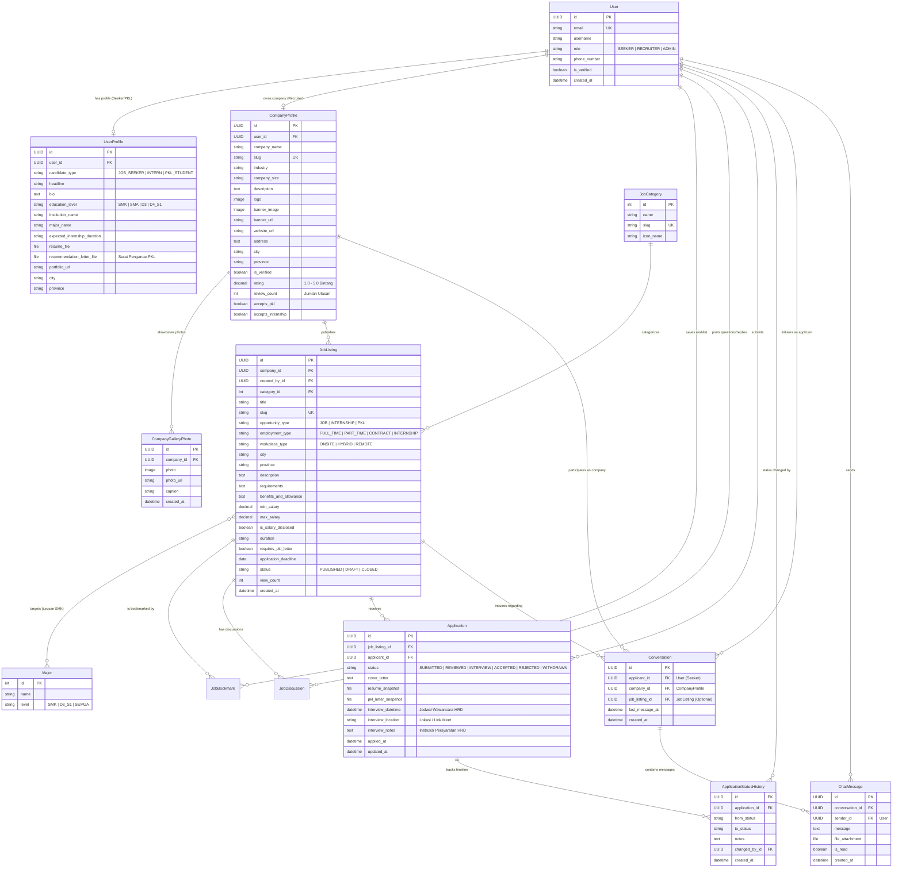

# Entity Relationship Diagram (ERD) & Database Specification
## Rekrut Mudah: Platform Rekrutmen Vokasi, Magang & Kerja Terpadu

---

## 1. Diagram Relasi Entitas (Mermaid ERD)

---

## 2. Rincian Kamus Data (Data Dictionary)

### 2.1 Modul Akun & Profil (`apps/accounts`)

#### Tabel: `accounts_user`
- `id`: Primary Key (UUID v4), menjamin keunikan identitas tanpa mengekspos ID berurutan.
- `email`: Email unik untuk autentikasi sistem.
- `role`: Tipe akun: `SEEKER` (Pelamar / Siswa PKL), `RECRUITER` (Perusahaan), `ADMIN`.
- `phone_number`: Nomor telepon/WhatsApp aktif untuk keperluan koordinasi cepat.
- `is_verified`: Status verifikasi email/dokumen resmi.

#### Tabel: `accounts_userprofile`
- `user_id`: One-to-One ke `accounts_user`.
- `candidate_type`: Menentukan segmentasi kandidat (`JOB_SEEKER`, `INTERN`, `PKL_STUDENT`).
- `education_level`: `SMK`, `SMA`, `D3`, `D4_S1`.
- `institution_name`: Nama institusi asal (contoh: SMKN 1 Jakarta, Politeknik Negeri Jakarta).
- `major_name`: Jurusan (contoh: Rekayasa Perangkat Lunak, Akuntansi).
- `recommendation_letter_file`: Surat Pengantar PKL dari sekolah (wajib untuk siswa SMK yang melamar PKL resmi).

#### Tabel: `accounts_companyprofile`
- `company_name`: Nama resmi badan usaha atau perusahaan mitra.
- `slug`: Slug URL ramah SEO (contoh: `pt-nusantara-teknologi-mandiri`).
- `logo` & `banner_image`: Identitas visual perusahaan.
- `accepts_pkl`: Boolean flag apakah perusahaan membuka program PKL untuk siswa SMK.
- `accepts_internship`: Boolean flag untuk magang mahasiswa.

#### Tabel: `accounts_companygalleryphoto`
- `company_id`: Foreign Key ke `CompanyProfile` (Cascade).
- `photo` / `photo_url`: Gambar foto fasilitas, ruang praktik, atau lab komputer.
- `caption`: Keterangan foto (contoh: "Lab Komputer & Coding Peserta PKL").

---

### 2.2 Modul Lowongan & Kategori (`apps/jobs`)

#### Tabel: `jobs_jobcategory`
- Menyediakan pengelompokan industri (Teknologi, Otomotif, Akuntansi, Desain, Perhotelan, dll.) dilengkapi icon Material Symbols.

#### Tabel: `jobs_major`
- Master data kompetensi keahlian/jurusan sekolah kejuruan (RPL, TKJ, OTKP, AKL, TKRO, dll.).

#### Tabel: `jobs_joblisting`
- `opportunity_type`: Penanda tipe lowongan (`PKL`, `INTERNSHIP`, `JOB`).
- `duration`: Khusus program PKL/Magang (contoh: "3 Bulan", "6 Bulan").
- `requires_pkl_letter`: Memvalidasi syarat Surat Pengantar PKL dari sekolah.
- `target_majors`: Relasi Many-to-Many ke `jobs_major` untuk mencocokkan kualifikasi siswa.

---

### 2.3 Modul Lamaran & ATS (`apps/applications`)

#### Tabel: `applications_application`
- Relasi antara Pelamar (`User`) dan Lowongan (`JobListing`).
- Constraint: `UniqueConstraint(fields=['job_listing', 'applicant'])` mencegah spam ganda.
- `resume_snapshot` & `pkl_letter_snapshot`: Menyimpan berkas saat melamar sehingga aman meskipun profil pengguna diperbarui di kemudian hari.

#### Tabel: `applications_applicationstatushistory`
- Catatan audit jejak tahapan seleksi: perubahan dari status awal ke status baru beserta catatan HR.

---

### 2.4 Modul Chat Interaktif (`apps/chat`)

#### Tabel: `chat_conversation`
- `applicant_id`: Foreign Key ke `User` (Pelamar).
- `company_id`: Foreign Key ke `CompanyProfile` (Perusahaan).
- `job_listing_id`: Foreign Key ke `JobListing` (Opsional, menautkan diskusi dengan lowongan spesifik).
- `last_message_at`: Timestamp pesan terakhir untuk pengurutan percakapan teratas di Inbox.
- Constraint: `UniqueConstraint(fields=['applicant', 'company', 'job_listing'])` untuk mencegah duplikasi thread percakapan dengan topik yang sama.

#### Tabel: `chat_chatmessage`
- `conversation_id`: Foreign Key ke `Conversation` (Cascade).
- `sender_id`: Foreign Key ke `User` (Pengirim pesan).
- `message`: Isi teks pesan pertanyaan atau jawaban.
- `is_read`: Status apakah pesan sudah dibaca oleh lawan bicara.
- `created_at`: Waktu kirim pesan (ISO timestamp).

---

## 3. Strategi Indexing & Integritas Basis Data
1. **Pencarian Cepat**:
   - Index pada `JobListing(status, opportunity_type, city)`.
   - Index pada `Conversation(applicant, company, last_message_at)`.
   - Index pada `ChatMessage(conversation, created_at)`.
2. **Keamanan Penghapusan Data**:
   - Penghapusan akun pelamar tidak menghapus riwayat audit lamaran yang telah masuk (`on_delete=models.SET_NULL` pada `created_by` / `changed_by`).
   - Obrolan chat dilindungi hak akses sehingga hanya partisipan percakapan (`applicant` atau HRD pemilik `company`) yang berhak membaca atau mengirim pesan.
